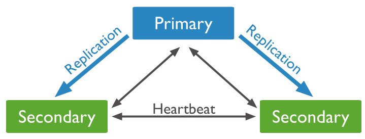

### BLOCO 24 DIA 1 - MongoDB: Updates Simples

---

### MongoDB: Updates Simples

---

### O que será feito hoje?

* Vamos aprender a atualizar documentos no MongoDB
* `updateOne()` & `updateMany()` 
* Operadores: `$set`, `$mul`, `$inc`, `$min`, `$max`, `$currentDate`, `$rename` e `$unset`

---

### Relembrando: MongoDB Design


---

### Do lado relacional destacamos:

* Uma Query Language flexível e poderosa
* Consistência forte (podemos ajustar isso de acordo com nossas necessidades)
* Índices secundários: podemos ter mais de um índice por coleção

---

### Do lado não relacional:

* A flexibilidade de arquitetura e schema design
* Escalabilidade
* Performance

---

### Comparando com banco relacional


---

## Ferramentas

* Compass
* Robo 3T
* NoSQL Manager
* *Mongo Shell* (o que vamos utilizar)

---

### Como deixar o Mongo Shell mais confortável

* [mongosh](https://github.com/mongodb-js/mongosh)
* [mongo-hack](https://www.github.com/tylerbrock/mongo-hacker/)
* [Todas as Ferramentas](https://docs.mongodb.com/tools/)

---

### MONGO SHELL

```
$ mongo
```

---

### Primeiros comandos

```js
show dbs;
use <db>;
show collections;
```

---

### INSERTS

---

### Escrita

* **Soft State:** 

* **Eventually Consistent:**

---

### SELECTS

---

### Selecionando tudo de uma colection

```js
db.inventory.find({}); // ou
db.inventory.find();

// equivalente a SELECT * FROM inventory;
```

---

### Especificando uma condição de igualdade

```js
// equivalente a SELECT * FROM inventory WHERE status = "D";
db.inventory.find({ status: "D" }); 
// equivalente a SELECT * FROM inventory WHERE status = "D" AND item = "paper";
db.inventory.find({ status: "D", item: "paper" });
```

---

### Projetando somente os campos requeridos

---

### EXEMPLO DE PROJEÇÃO

```js
db.inventory.find({ status: "A" }, { item: 1, status: 1 }); // ou
db.inventory.find({ status: "A" }, { item: true, status: true });

db.inventory.find({ status: "A" }, { status: 0 }); //ou
db.inventory.find({ status: "A" }, { status: false });
```

---

### Relacionamentos

---

## 1:1 (um para um)

---

## 1:N (um para muitos)

---

### Procurando em sub-documentos

```js
db.users.find({ "addresses.state": "NY" }).pretty();
```

---

## Métodos de cursor limit() e skip()

---

## **limit()**

```js
db.inventory.find().limit(2);
db.inventory.find({ status: "A" }).limit(1);
```

---

## **skip**
```js
db.inventory.find().skip(2);
```
---

**skip() e limit()**
```js
db.inventory.find({}, { item: 1 }); // retorna todos os cinco documentos
db.inventory.find({}, { item: 1 }).skip(0).limit(2); // retorna o primeiro e segundo documentos
db.inventory.find({}, { item: 1 }).skip(1*2).limit(2); // retorna o terceiro e quarto documentos
db.inventory.find({}, { item: 1 }).skip(2*2).limit(2); // retorna o último elemento
db.inventory.find({}, { item: 1 }).skip(3*2).limit(2); // retorna nada
```

---

### Remover coleções

```js
use class;
db.inventory.drop();
db.users.drop();
```

--- 

