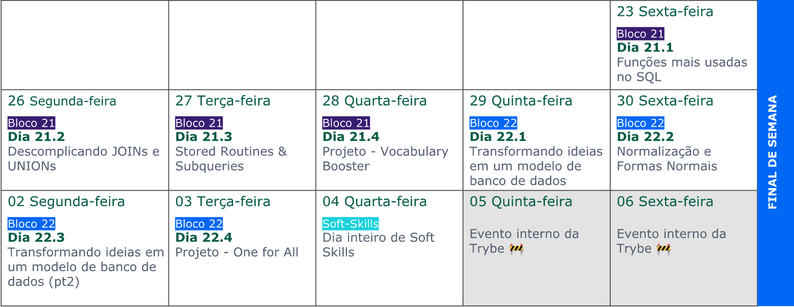

## BLOCO 21

{ width=60% }

---

### O que vamos aprender?

{ width=40% }

---

### Funções mais usadas no SQL

---

#### Funções

{ width=70% }

---

#### Agrupamentos

{ width=70% }

---

### Descomplicando Joins Unions e Subqueries

---

#### Os tais relacionamentos dos bancos relacionais

{ width=80% }

---

### Vamos aprender a crias nossas "Functions" no SQL

---

## 

---

### VQV! 🚀

## { width=50% }
