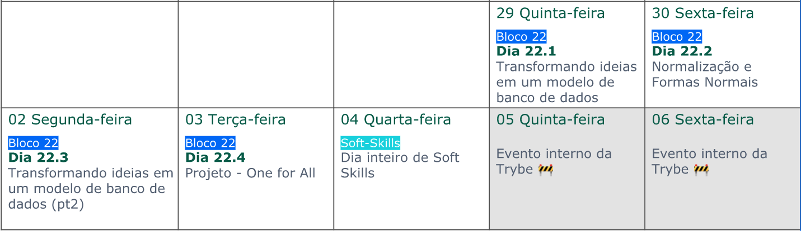

### Apresentação de Bloco

{ width=40% }

---

{ width=70% }

---

## Foco do bloco

---

### Criação e modificação de tabelas

---

### Boas práticas na criação - Formas Normais

---

### Views

{ width=70% }

---

### Views

{ width=70% }

---

### Trabalhando com índices

{ width=50% }

---

### Trabalhando com índices

## { width=50% }

---

### Trabalhando com índices

## { width=70% }

---

### Calendário

---

### #GoMarte

## { width=70% }
