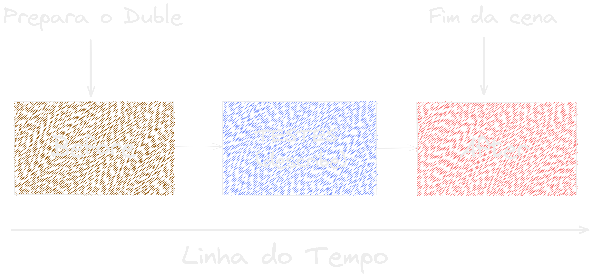
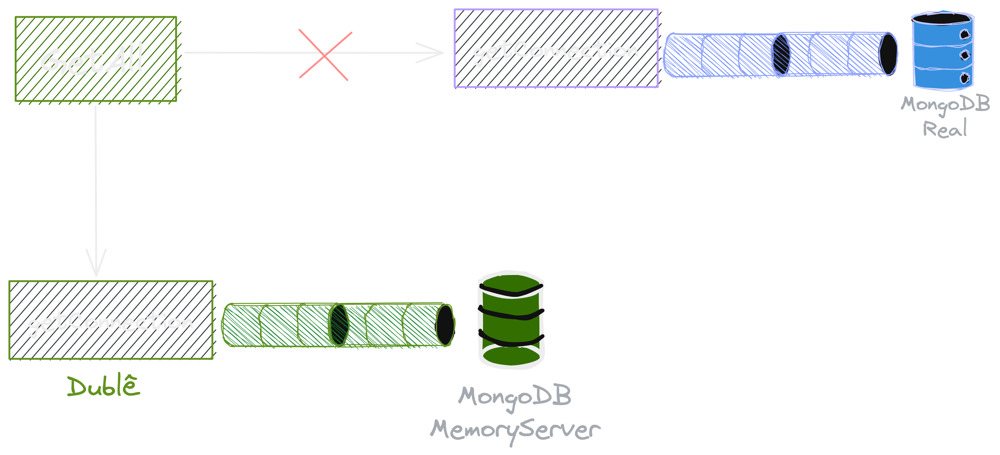

### Testes de Unidade \o/

---

### O que vai rolar hoje?

- **Testes no Model**
- **Testes no Service**
- **Testes no Controller**
- **Testes no ❤️**
- **E com o nosso amado TDD 💚**

---

#### Sequência do course

---

### Let's Test!

{width=40%}

---

### Dubles

---

#### Preparar os dublês de teste

---

#### Como o duble trabalha?

{width=95%}

---

### Dúvidas?

{ width=90% }
