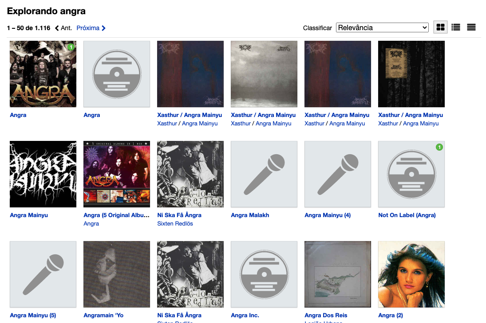
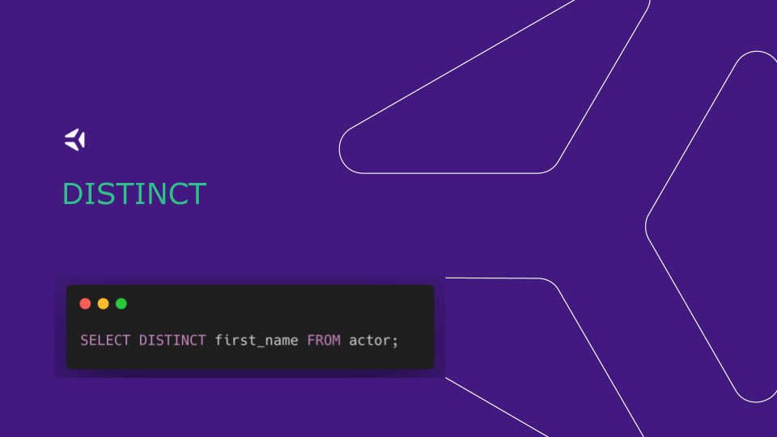

## 20.2 - ENCONTRANDO DADOS EM UM BANCO DE DADOS

---

## Foco de hoje

- QUERY
- DISTINCT
- LIMIT
- OFFSET
- COUNT
- ORDER BY

---

## Nãó é foco de hoje

* Criar tabelas
* Aprender sobre detalhes específicos do Workbench
* Falar sobre arquitetura / cloud / devops

---

### Queries

---

Postgres VS MySQL

---

Postgres VS MySQL

---

SQL Server VS MySQL

---

{ width=100% }

---

### PAGINAÇÃO

{ width=100% }

---

### LIMIT

{ width=100% }

---

### OFFSET

{ width=100% }

---

### Como calcular totais?

{ width=100% }

---

### COUNT

{ width=70% }

---

### Nao conta nulls

{ width=40% }

---

{ width=90% }

---

### Revisão

---

{ width=100% }

---

{ width=100% }

---

{ width=100% }

---

{ width=100% }

---

{ width=100% }

### Dúvidas?

{ width=90% }

---

### Momento Spoiler

Como podemos aplicar os aprendizados de hoje?
