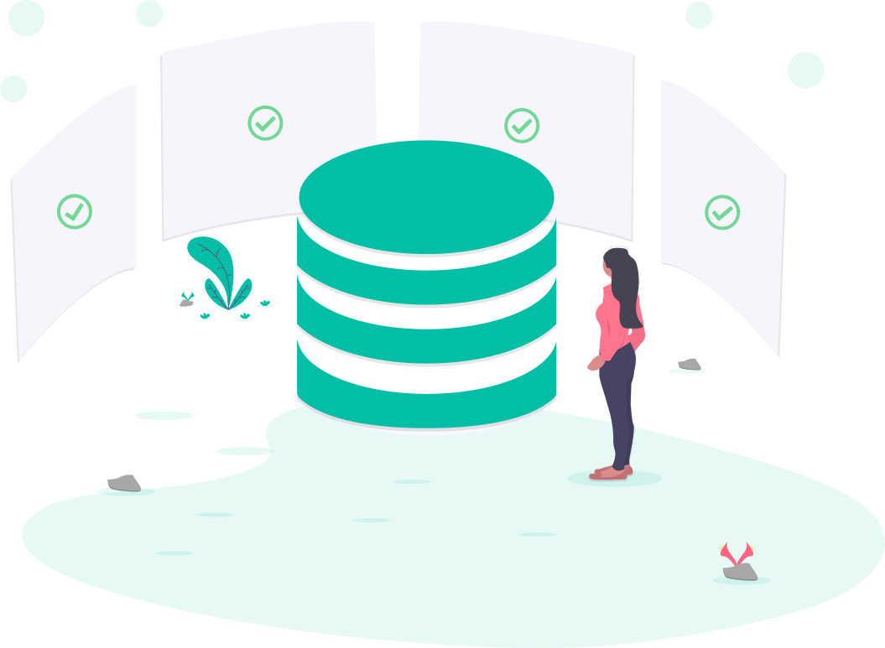
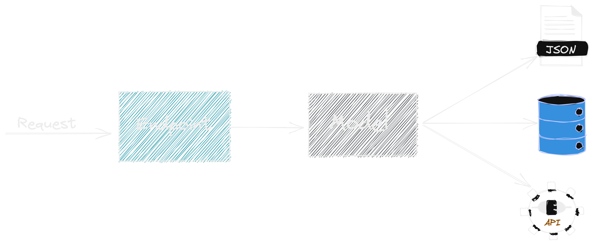
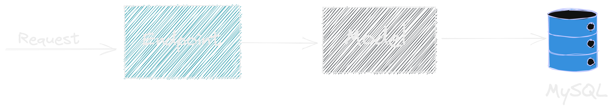
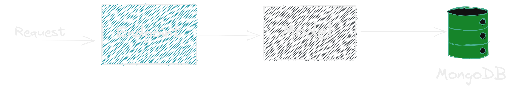
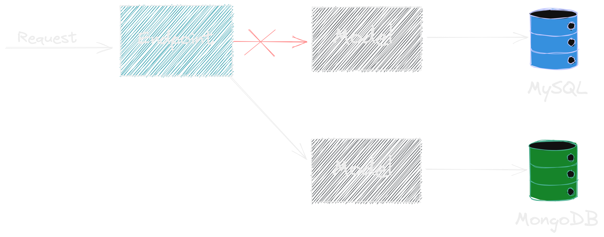

## Camada Model

{width=70%}

---

### O que vamos aprender hoje?

- **E o tal do Model?**
- **Conectar nossa API com o MySQL**
- **Conectar nossa API com o MongoDB**

---

### O que é o model?

---

### O que é o model?

---

### Model com MYSQL

---

### Model com MongoBD

---

### Se quiser fazer a mudança?

---

### Dúvidas?

{ width=90% }
