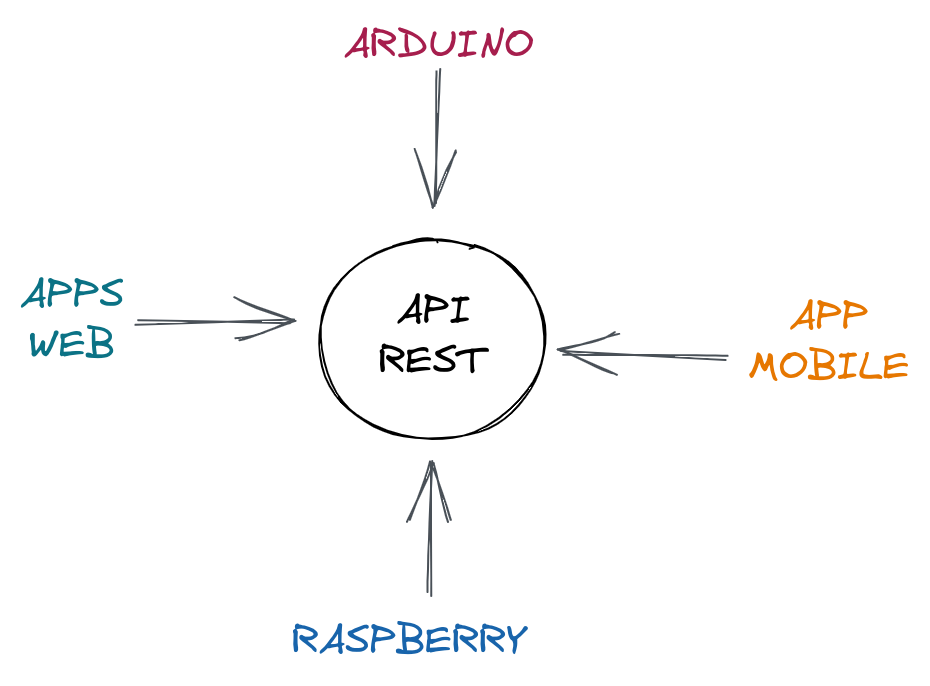
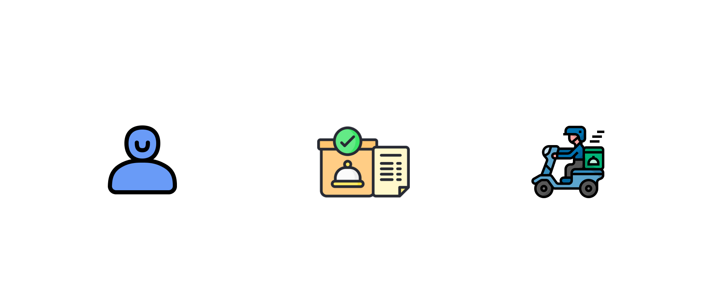
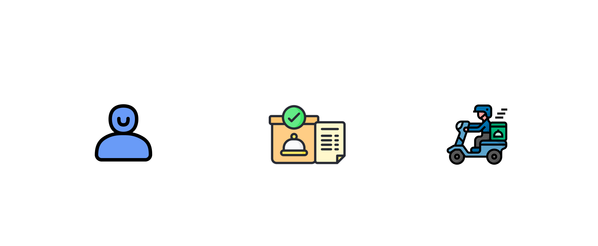
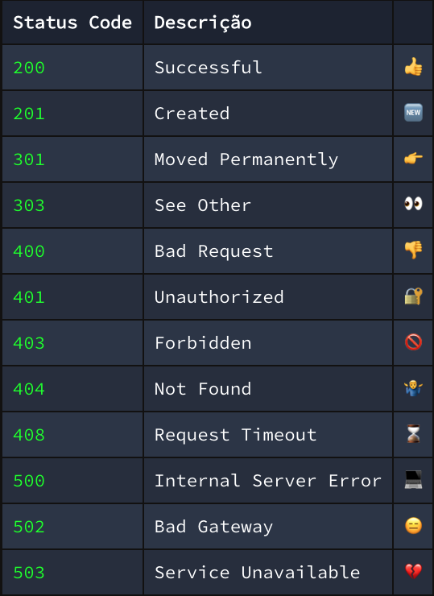

### Boas práticas em APIs

{width=40%}

---

### O que teremos Hoje

- **Rest**
- **Rest vs. Restful**
- **Status Code**

---

### Objetivo do REST

- **PADRONIZAR CONSTRUÇÃO DE APIS**
- **Reduzir o tempo de aprendizado de uma pessoa ao usar API**

---

### REST VS. RESTFUL

Uma API Restful é uma API que segue o padrão REST.

---

#### O que precisa para ser RESTFUL?

- Usar os status de retornos e os Verbos HTTP Corretos

---

#### O que precisa para ser RESTFUL?

---

#### O que precisa para ser RESTFUL?

- Usar os status de retornos e os Verbos HTTP Corretos
- Separação entre Cliente e servidor

---

#### O que precisa para ser RESTFUL?

{width=70%}

---

#### O que precisa para ser RESTFUL?

- Usar os status de retornos e os Verbos HTTP Corretos
- Separação entre Cliente e servidor
- Não tem estado entre as comunicações
  (cada endpoint é autossuficiente)

---

#### O que precisa para ser RESTFUL?

- Usar os status de retornos e os Verbos HTTP Corretos
- Separação entre Cliente e servidor
- Não tem estado entre as comunicações
  (cada endpoint é autossuficiente)
- Ter a ideia de recursos

---

### Recurso?

---

### Recurso

---

### Bora para o código

{width=52%}

---

{width=65%}

###### Imagem do site - xeonbd.com

---

### HTTP Status Code

###### Imagem do site - erudio.com.br

---

#### Mais usados

{width=44%}

---

### Dúvidas?

{ width=90% }
