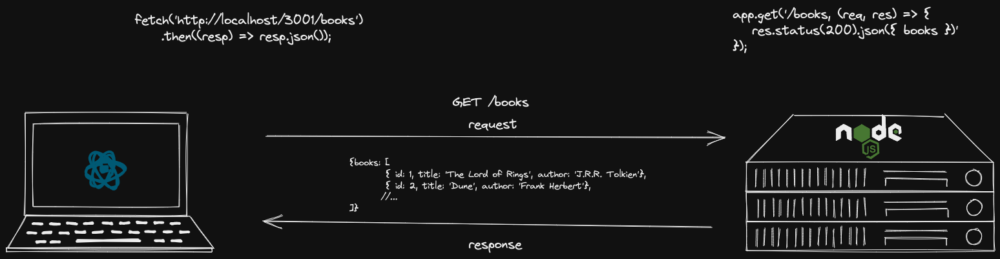

### Node: HTTP com Express

---

### O que vamos aprender?

- Revisar alguns conceitos sobre HTTP
- Como estruturar uma API HTTP
- Como criar uma aplicação Node com Express
- Definição de rotas

---

### HTTP


---

### API HTTP



---

### Express

---

### Como criar uma aplicação express?


---

#### Como criar nossa primeira rota?

---

### Montando nossa API de Livros

```
const books = [
	{ id: 1, title: 'The Lord of Rings', author: 'J.R.R. Tolkien'},
	{ id: 2, title: 'Dune', author: 'Frank Herbert'},
	{ id: 3, title: 'Foundation', author: 'Isaac Asimov'},
	{ id: 4, title: 'The Man in The High Castle', author: 'Philip K Dick'},
	{ id: 5, title: '1984', author: 'George Orwell'},
	{ id: 6, title: 'Brave New World', author: 'Aldous Huxley'}
]
```

---

### Definindo as rotas


---

### Continua...

