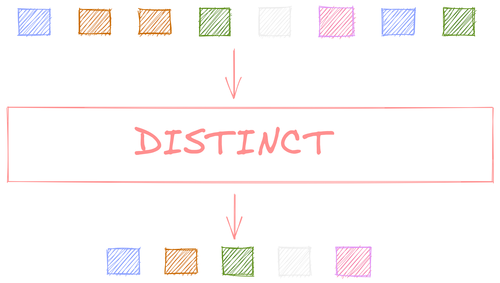
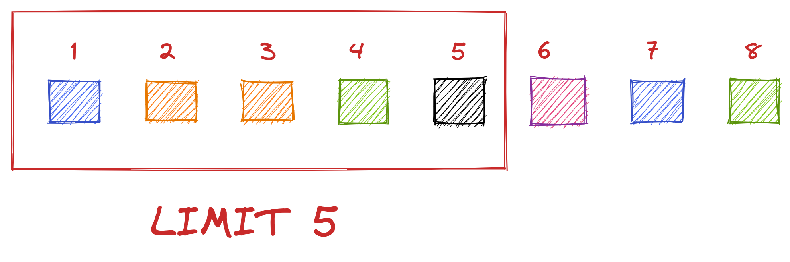
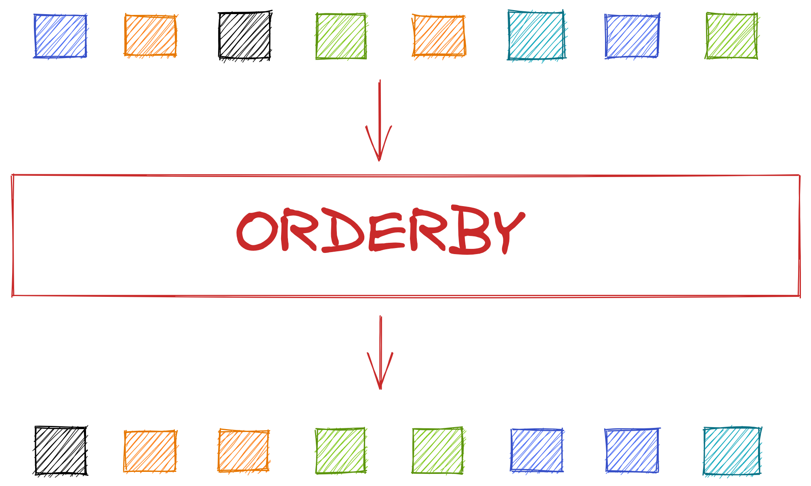

## 20.2 - ENCONTRANDO DADOS EM UM BANCO DE DADOS

---

## Foco de hoje

- QUERY
- DISTINCT
- LIMIT
- OFFSET
- COUNT
- ORDER BY

---

{ width=100% }

---

### LIMIT

{ width=100% }

---

### OFFSET

{ width=100% }

---

### COUNT

{ width=70% }

---

### Nao conta nulls

{ width=40% }

---

{ width=90% }

---

### Dúvidas?

{ width=90% }
