## JOIN, Subqueries e Union

{ width=60% }

---

## Foco de hoje

- JOIN
- UNION
- Subqueries

---

### INNER JOIN

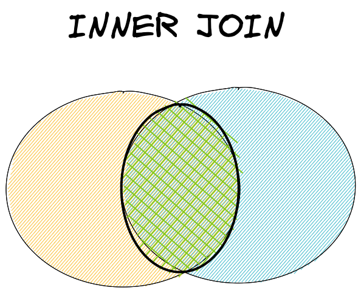

---

### INNER JOIN

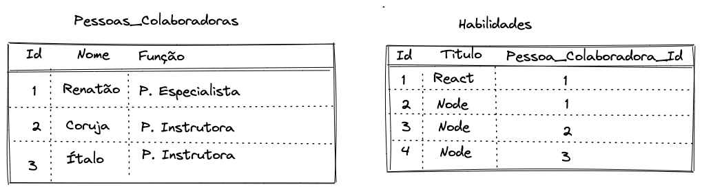

---

### INNER JOIN

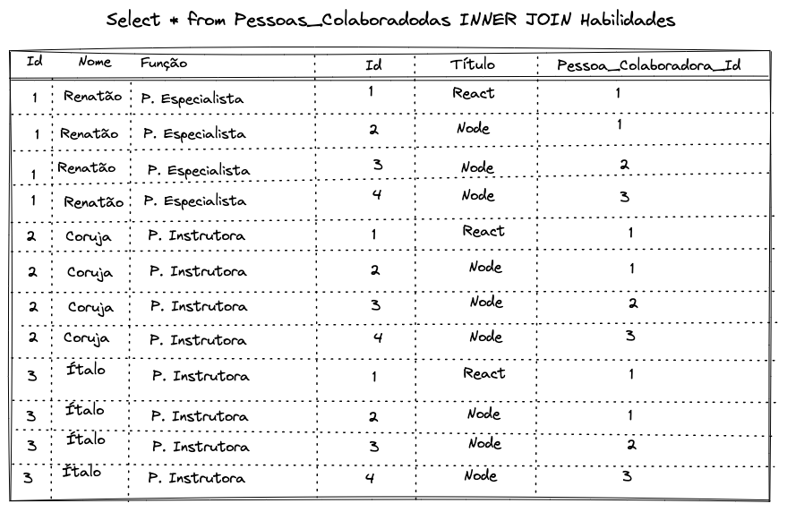

---

### INNER JOIN

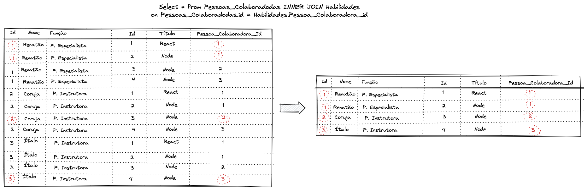

---

### INNER JOIN

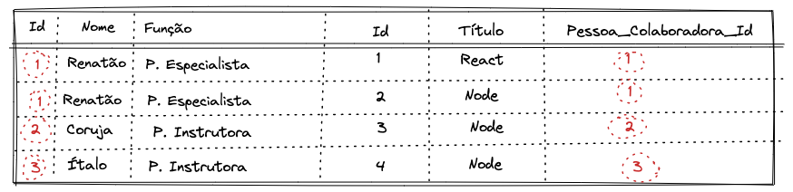


---

### LEFT JOIN

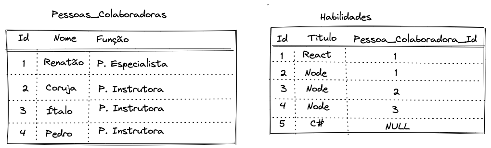

---

### LEFT JOIN

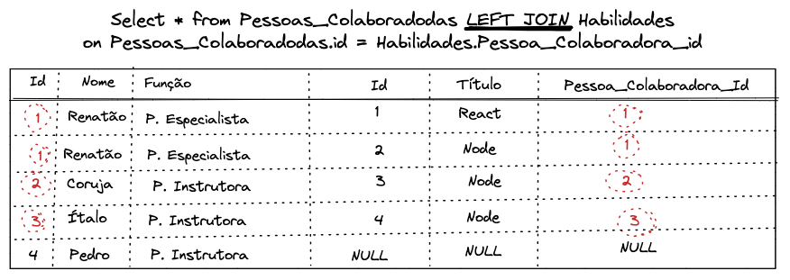

---

### RIGHT JOIN


---

### RIGHT JOIN

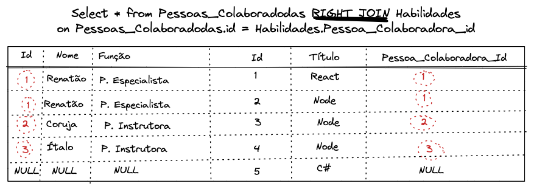

---


### SELF JOIN

```sql
SELECT * FROM sakila.actor a, sakila.actor B
WHERE a.first_name=b.first_name;
```

---

### UNION

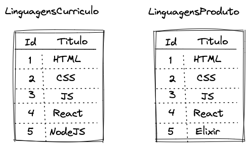

---

### UNION

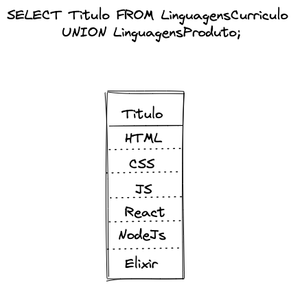

---

### UNION ALL

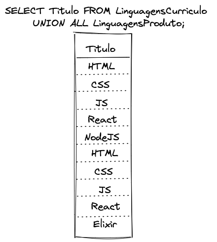

---

### SUBQUERY

---


### Dúvidas?

{ width=90% }
