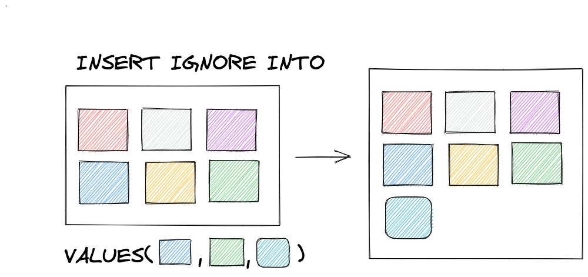
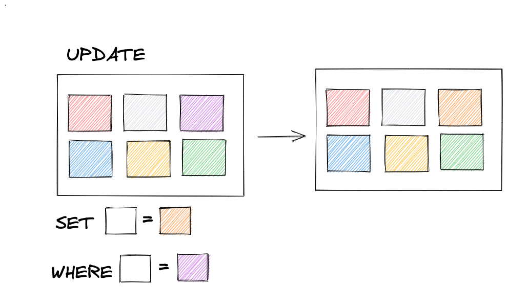
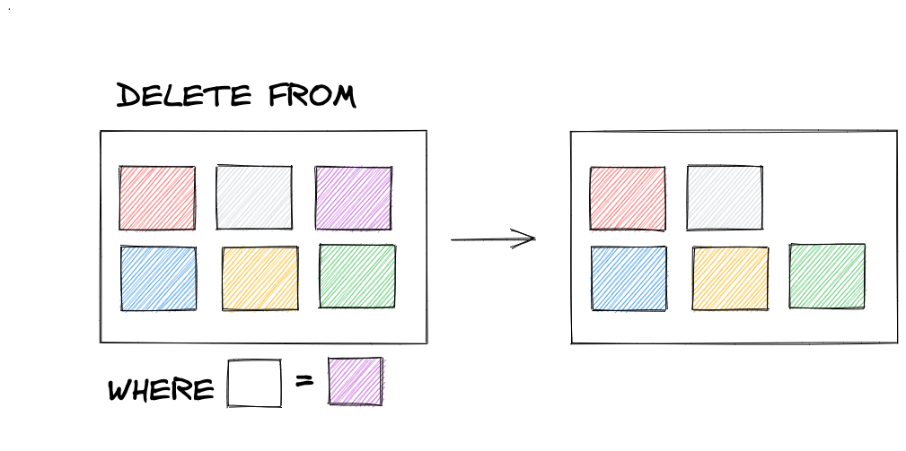

## Manipulando tabelas

{ width=60% }

---

## Foco de hoje

- INSERT
- UPDATE
- DELETE

---

## INSERT

{ width=55% }

---

## INSERT INGORE

{ width=55% }

---

## UPDATE

{ width=55% }

---

### Premio Update sem Where

{ width=55% }

---

{ width=55% }

---

## DELETE

{ width=55% }

---

### Não seja um leitor deste livro!

{ width=80% }

---

{ width=55% }

---

### TRUNCATE vs. DELETE

---

### Dúvidas?

{ width=90% }
