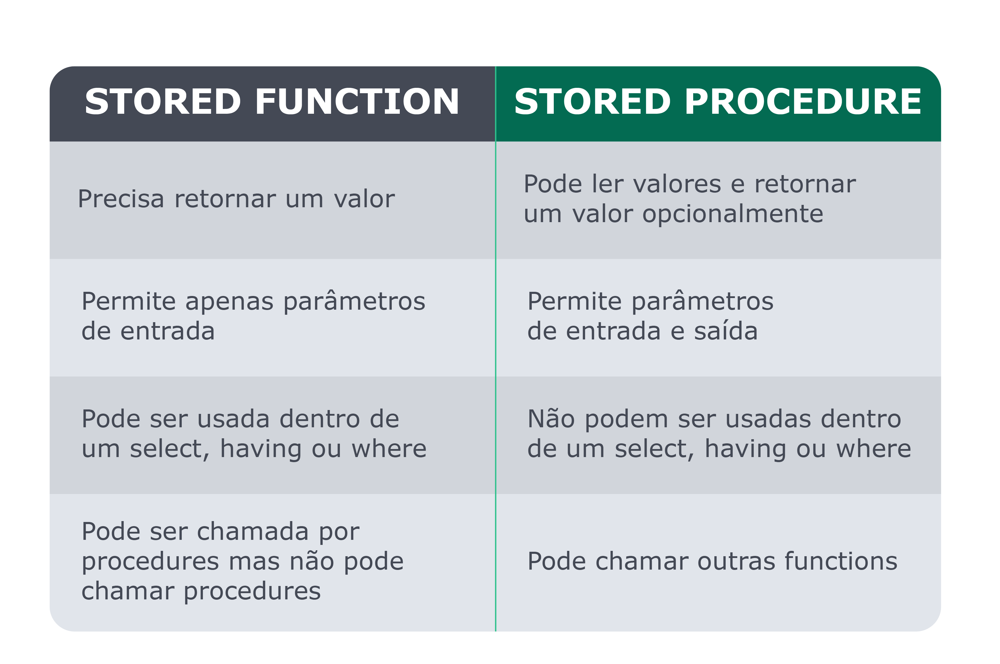
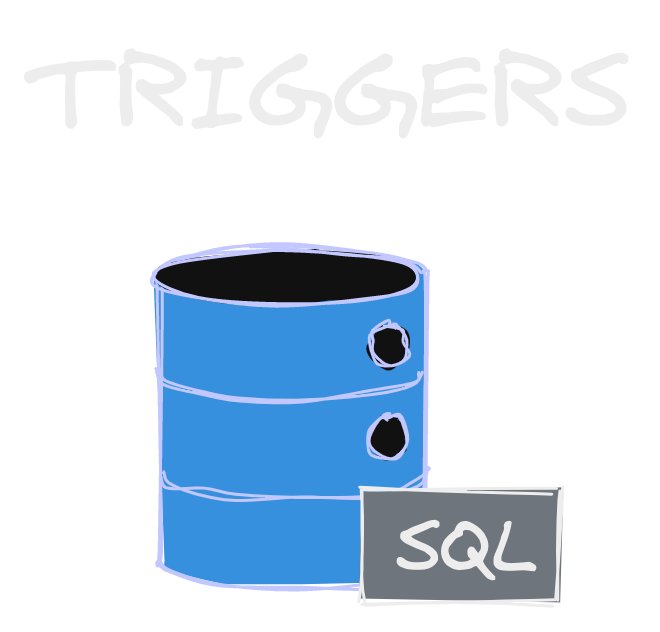
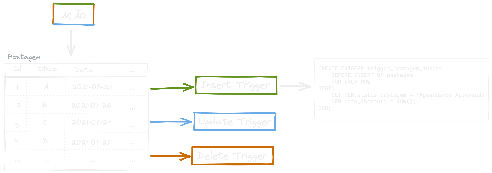
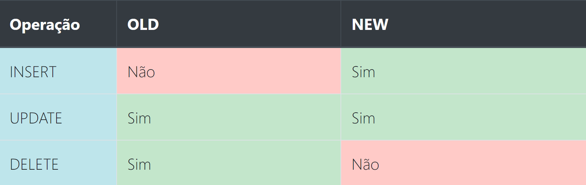

### Stored Routines & Triggers

{ width=60% }

---

### Stored Routines

Para que serve Stored Routines?

---

---

## Stored Procedure

---

### Parâmetros

- IN
- OUT
- INOUT

---

### Intervalo

---

## Stored Functions

---

### Tipos de retorno

---

### **DETERMINISTIC**

{ width=30% }

Sempre retorna o mesmo valor ao receber os mesmos dados de entrada.

---

### **READS SQL DATA**

{ width=50% }

Indica para o MySQL que sua função irá somente ler dados, e não modifica tabelas.

---

{ width=60% }

---

---

### Quando temos acesso aos valores?

---

### Dúvidas?

{ width=90% }
