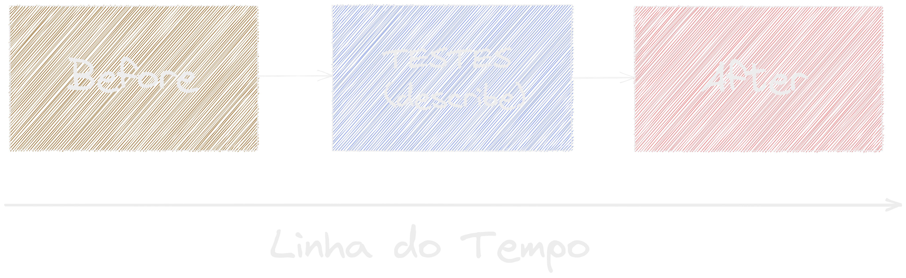
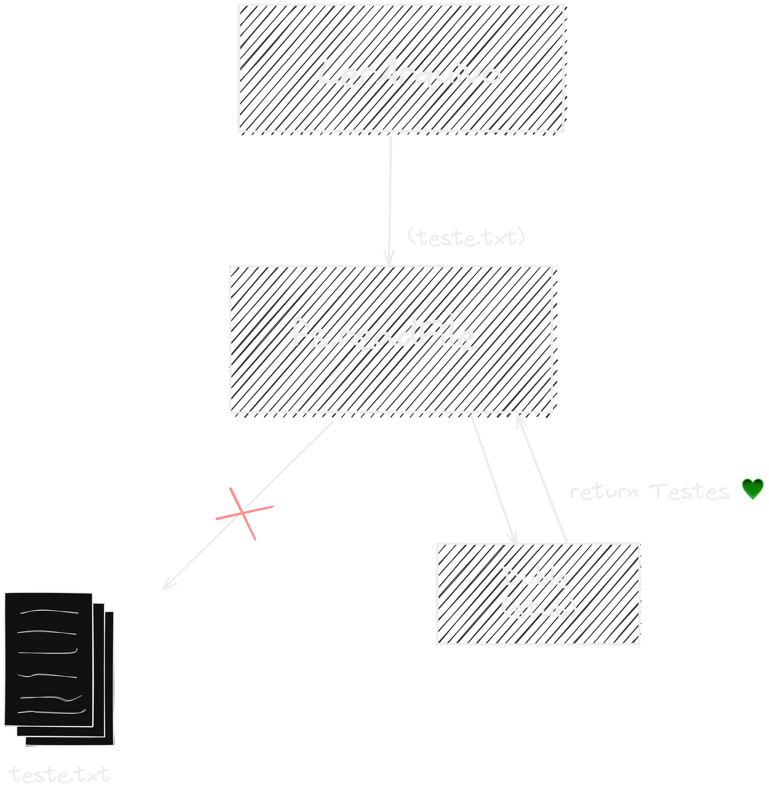

### Testes de Unidade \o/


---

### O que vamos aprender

- **Testes no Node**
- **Mocha**
- **Chai**
- **Sinon**
- **Usaremos TDD 💚**

---

### Voltando ao TDD


---

### Ferramentas


---

### Let's Test!

{width=40%}

---

### Organização


---

#### Rodar algo antes e depois dos testes



---

### Dubles


---

#### Onde vamos usar isso?


---

#### Como o duble trabalha?

{width=58%}

---

### Let`s code

```
Executa a função calculaArea
	a resposta é
		✔ é um "number"
		✔ ao ler o valor 10 o retorno é igual a 100
```

---

### Dúvidas?

{ width=90% }
