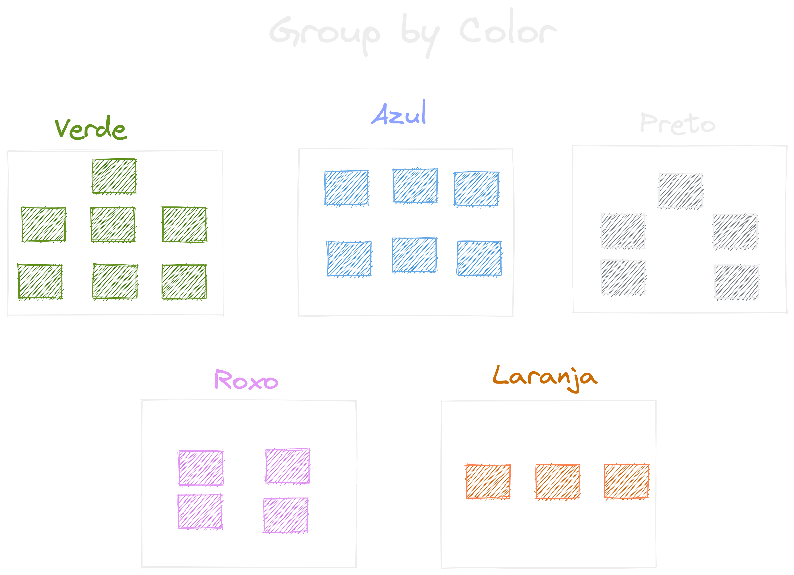

## Funções mais usadaa

{ width=60% }

---

## Foco de hoje

- If / Case
- Strings
- Operadores Matemáticos
- Operações com datas
- Funções de Agregação
- Agrupamentos
- Filtro de Agrupamento(Having)

---

### IF / CASE

> E se?

---

#### Descubra se uma pessoa é maior de idade

```sql
SET @age = 14;
SELECT IF(@age < 18, 'Di maior', 'Di menor');
```

---


### Strings

* LENGTH
* UCASE
* LCASE
* REPLACE
* LEFT
* RIGHT
* SUBSTRING.

---

### Operadores matemáticos

{ width=50% }

---

* DIV
* MOD
* ROUND
* CEIL
* FLOOR
* POW
* SQRT
* RAND

---

### Operadores aritméticos
> Calculando ...

```sql
SELECT 10 + 10;

SELECT 10 - 10;

SELECT 10 * 10;

SELECT 10 / 10;
```

---

### Outros operadores

```sql
SELECT 20 DIV 3; -- retona o número inteiro da divisão

SELECT 18 MOD 3; -- retorna o resto de uma divisão inteira

SELECT ROUND(20.49, 1); -- permite arredondar um valor

SELECT CEIL(20.51); -- arredonda para o número inteiro (cima)

SELECT FLOOR(10.51); -- arredonda para o número inteiro (baixo)

SELECT POW(2, 5); -- potenciação onde temos X elevado a Y.

SELECT SQRT(16); -- retorna a raiz quadrada
```

---

### Operações com datas

{ width=50% }

---

* CURRENT_DATE
* NOW
* DATEDIFF
* TIMEDIFF

---

#### Diferença entre datas

```sql
SELECT DATEDIFF('2020-05-01', '2020-05-31');
SELECT DATEDIFF(return_date, rental_date) FROM sakila.rental;
```

---

#### Diferença de tempo

```sql
SELECT TIMEDIFF('05:15:30', '06:15:30');
SELECT TIMEDIFF('05:15:30', '05:12:30');
SELECT TIMEDIFF(return_date, rental_date) FROM sakila.rental;
```

---

#### Extraindo uma parte expecifica da data
```sql

SELECT return_date, DATE(return_date) FROM sakila.rental;

SELECT return_date, MINUTE(return_date) FROM sakila.rental; 

```

---


### Funções de Agregação

> Geralmente utilizados em relatórios e gráficos

{ width=50% }

---

{ width=90% }

```sql
SELECT MIN(rental_duration) FROM sakila.film;
```

---

{ width=90% }

```sql
SELECT MAX(rental_duration) FROM sakila.film;
```

---

{ width=90% }

```sql
SELECT AVG(rental_duration) FROM sakila.film;
```

---

{ width=90% }

```sql
SELECT SUM(rental_duration) FROM sakila.film;
```

---

{ width=90% }

```sql
SELECT COUNT(rental_duration) FROM sakila.film;
```

---

### Group By

---

{ width=70% }

---

{ width=80% }

---

### Having

(Where dos grupos)

---

{ width=80% }

---

{ width=80% }

---

### Dúvidas?

{ width=90% }
