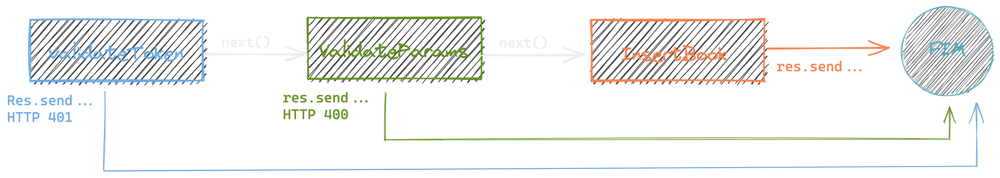

### Middlewares

{width=30%}

---

### O que vamos aprender

- **Melhorar a qualidade do nosso código**
- **Para que serve um Middleware**
- **Como usar?**
- **Middleware de erro**
- **Organizando a casa com o Routers**

---

### Problema

- ##### Verificar se foi enviado um token através do headers que seja igual a palavra `secret`.
- ##### Verificar se o título do livro foi preenchido.
- ##### Verificar se o nome do autor foi preenchido.
- ##### Caso esteja tudo válido salvar o novo livro e retornar a mensagem `cadastrado com sucesso`.

---

### Middleware

---

{width=93%}

---

### Middleware

---

### Middleware

- **Reaproveitar código**
- **Separar em etapas com responsabildiades unicas**

---

### Middleware de Erro

---

### Rescue

---

### Dúvidas?

{ width=90% }
